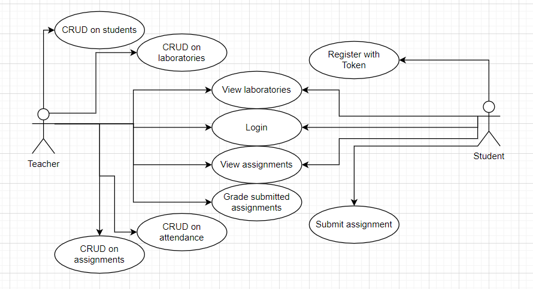
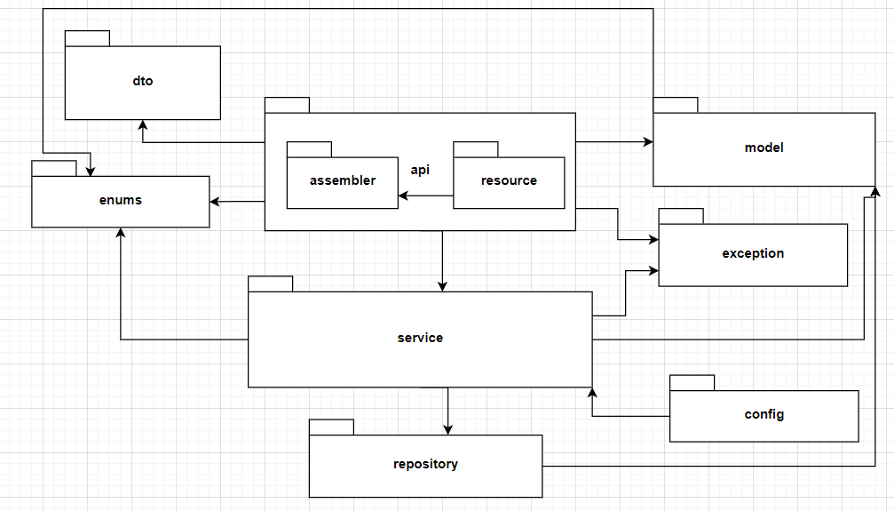
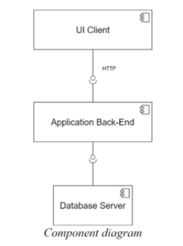
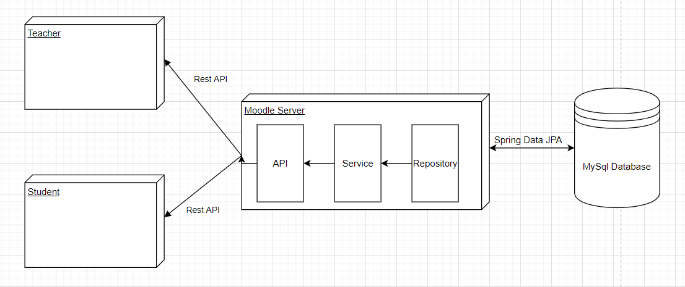

# Moodle for Software Design


Software Design Laboratory - Assignment 2 - Spring, 2021

> Technical University of Cluj-Napoca\
Computer Science\
2021, Spring

## **Usage**

### Clone the repository

- **``
git clone https://github.com/blasio99/Moodle4SoftwareDesign.git
``**

### Configure the database connection

- Go to the **`moodle\moodle-server\src\main\resources`** folder
- Use the **`application.properties`** file as a template
- Create your own properties file with the name, for example, **`application-dev.properties`**
- At **`line 6`** personalize your database details
- At **`line 8 and 9`** set your **`username`** and **`password`** for the database

### Insert some personal data to the database

- Go to the **`moodle\moodle-server\src\main\resources`** folder
- In the **`import.sql`** file modify the entries with your own ones
  
___

<br/>

## **Documentation**

### **Objective**

The objective of this assignment is to allow students to become familiar with MVC architectural pattern, services, repository and unit tests.

### **Application Description**

Use JAVA Spring/C# Web API to design and implement an application for the tracking the laboratory activity for the Software Design laboratory. The application should have two types of users (student and teacher) which must provide an email and a password to use the application.  

The __teacher__ can perform the following operations:

- __Login__
- __CRUD on students__. When you create a student, a 128 characters token is created. Using that token student should be able to register. Teacher will send the token by email manually (not part of the scope of the application). For each student we should track: email address, full name, group (ex. 30434) and hobby – free field.
- Can add/edit/delete Laboratory classes. For each class we should track: laboratory number (#1-#14), date, title, curricula for what are the topics presented in that lab and a long description with the laboratory text.
- __CRUD on attendance__ for each lab.
- __CRUD on assignments__. Some of the laboratory will have assignments: for each
assignment we must track the name, deadline and a long description with the assignment
text.
- __Grade__ the submitted assignments individually.

The student can perform the following operations:  

- Register using the token generated by the teacher, at this step they must provide the password.
- Login with the username and password.
- View a list of laboratory classes.
- View the assignments for a laboratory class.
- Create an assignment submission. Here, students should be able to insert a link to a git repository and a short comment (optional) for the teacher.

### __Application Constraints__

- The data will be stored in a relational database. Database model should respect 1st, 2nd and 3rd normal forms and proper relations between tables (1:1, 1:n, m:n)
- Use the MVC architectural pattern to organize your application. For this assignment we will create only the backend part (Model, Controller, Services (Business layer) and Repositories).
- API design should be RESTful (and not SOAP)
- Use an ORM (Hibernate / Entity framework) to access the database
- Use dependency injection to inject Services in Controllers and Repositories in Services
- Install and use Swagger to call your APIs / Or provide a Postman collection
- Connection string and magic strings should be stored in a separate config file

<br/>

#### **Model UML use-case diagram**

<br/>
 </img>

### **Approach**

- The system is based on the client-server architecture
- The backend server will be implemented as a Java Spring application following an enterprise architecture comprising a data access layer, a service layer as well as an API layer. For data access a MySql database is used, while the API falls into the RESTful category. All of this is made possible by the Spring framework

## **Design**

___

### **BACKEND**

The Layers architectural pattern will also be used in order to structure the application by diving it into groups of subtasks based on their functional responsibility.  

By using this pattern, the maintainability of the application and the reusability of components are considerably improved.
There 4 types of layers:

- `Presentation Layer`
- `Model Layer`
- `Service Layer`
- `Repository Layer`

### **Model Layer**

Firstly we identify the entities representing the problem at hand, namely: `User` (teacher or student), `Attendance`, `Assignment`, `Laboratory`, `SecureToken` and `Submission`.

### **Repository Layer**

This layer is for manipulating the data in the database. In this case there is needed to create for each model class a Data Access Object which, in this project, will be interfaces extending Spring's CrudRepository generic interface.

As far as implementation goes, we simply extend the generic `CrudRepository<M, ID>` interface provided by Spring with the corresponding interfaces, that being

- `UserRepository<User, Long>`
- `AssignmentRepository<Assignment, Long>`
- `AttendanceRepository<Attendance, Long>`
- `LaboratoryRepository<Attendance, Long>`
- `SecureTokenRepository<Attendance, Long>`

and add any specific query methods(if needed) and then the rest of the implementation is automatically generated upon the start of the application.

**Mention**: The implementation of database access is handled automatically by Hibernate, embedded in the Spring Data JPA module.

### **Service Layer**

In this layer every model class gets a corresponding Service class which makes operations on the given model class based on what is needed and specified by the project description.

```{build.gradle}
dependencies {
    Model Layer
    Repository Layer
}
```

### **Presentation Layer (API Layer)**

In most cases the Presentation Layer is the view part of a project, but since we have a frontend we just simplifying the data in JSON format which is sent to the **frontend**.

**Mention**: we work with REST API

___

#### **Package diagram**

At package design level, each layer is assigned a package, which is responsible for the whole functionality of that specific layer.

 </img>


#### __Component and deployment diagrams__

The component diagram contains the layout of the system at a physical component level, namely the files, libraries, executables. Taking this into consideration, the following component diagram was computed:

 </img>

The deployment diagram contains the physical layout of the system grouped by tiers. The Database Server represents a tier, the Application Server can be depicted as another one, along with the Web Client Service. Thus, the deployment diagram is the following:

 </img>

## **Contributing**

Contributions are what make the open source community such an amazing place to be learn, inspire, and create. Any contributions you make are **greatly appreciated**.  

- Fork the Project  
- Create your Feature Branch ( **`git checkout -b feature/AmazingFeature`** )
- Commit your Changes ( **`git commit -m 'Add some AmazingFeature'`** )
- Push to the Branch ( **`git push origin feature/AmazingFeature`** )
- Open a Pull Request  

## **Contact**

- Benedek Balázs - [LinkedIn Profile](https://www.linkedin.com/in/balazs-benedek-009322183/)
- E-mail: benedekbalazs1999@gmail.com
- Project Link: [GitHub - Moodle for University](https://github.com/blasio99/Moodle4SoftwareDesign)

___

## **References**

Software Design Course @TUCN

[REST Controllers in Java using Spring](https://www.baeldung.com/category/rest/)

[Spring Data JPA](https://www.baeldung.com/the-persistence-layer-with-spring-data-jpa)

[Dependency Injection in Spring](https://www.baeldung.com/inversion-control-and-dependency-injection-in-spring)
